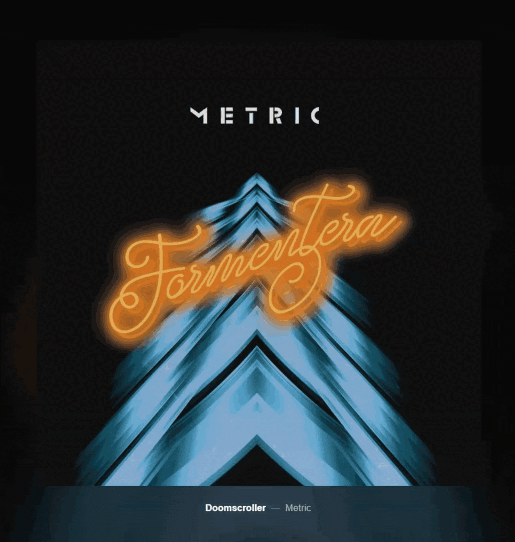
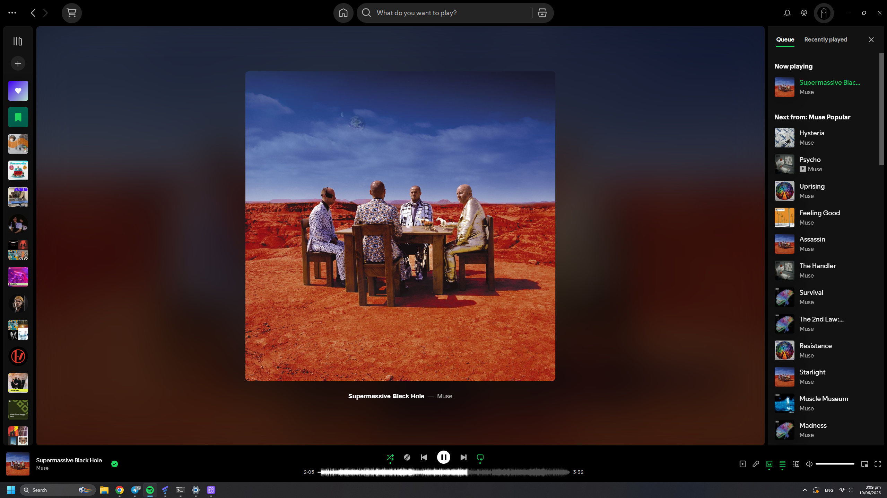
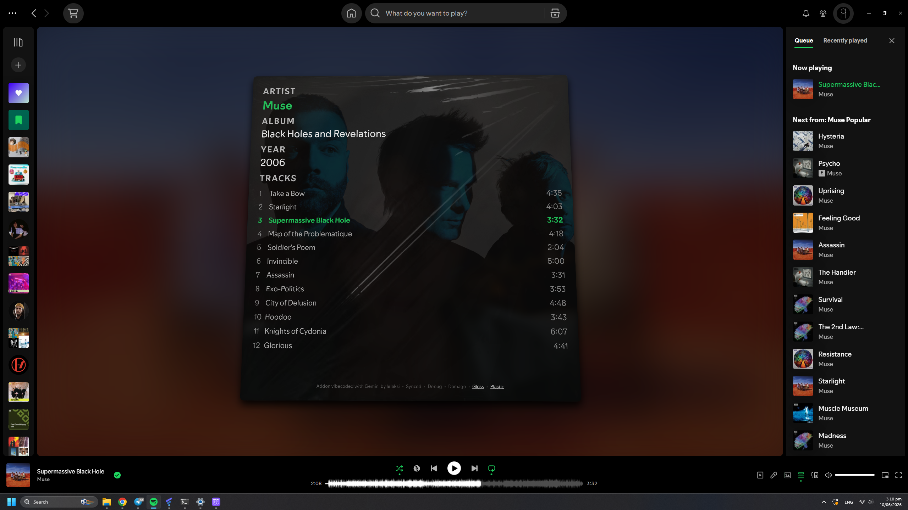

# Large-scale album art
### Giving album art the love it needs on spotify

---

### What?

Adds a page to spotify where you can properly look at the album art. The extension scans multiple sources to find the highest-resolution picture available, so that when zooming in the detail is there, and displays the album/single info on the back. You can also toggle various realism settings like dust or plastic warp. The album and artist names on the back are clickable if you want to jump straight to their profiles

---

### Why?

For a while, I was tired of how Spotify shows the album art in a small corner at best, even when resizing, you can't get it as big as, say, YouTube Music. So, I asked gemini to help me make an add-on that would show a huge cover. After visiting a few record stores, I got the idea to make it look a bit like a vinyl disc cover The code is rather sloppy but seems to be good enough

---
### Installation
Install from spicetify marketplace or download the .js and put it into C:\Users\USERNAME\AppData\Local\spicetify\Extensions or C:\Users\USERNAME\AppData\Roaming\spicetify\Extensions (i have no idea which one of them is the correct one lol)
